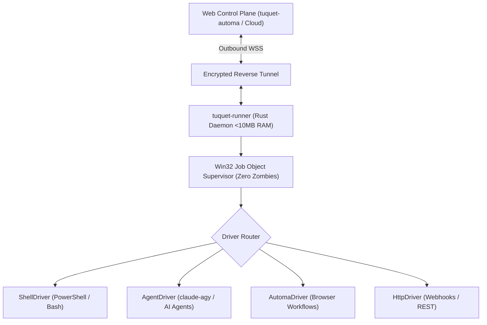

# ⚡ Tuquet-Runner (`tuquet-runner`)

> **Ultra-high performance universal distributed execution engine in Rust**. Orchestrates AI Agents (`claude-agy`), browser workflows (`tuquet-automa`), native shell scripts, and webhooks across distributed nodes with sub-10MB RAM footprint, zero cold-start latency, and kernel-level process supervision.

[](#installation)
[](LICENSE)
[](#1-windows-via-scoop-recommended)

---

## 🏗️ Architecture

`tuquet-runner` decouples the **Control Plane** (Web Studio / Dashboard / Cloud Hub) from the **Distributed Execution Plane** (Workstations / Edge Nodes):



---

## ✨ Key Features

- **Blazingly Fast (Rust Native)**: 1–3ms cold start, single standalone `.exe` (~8MB) with zero external runtime dependencies.
- **Kernel-Level Zero-Zombie Guarantee**: Uses Win32 **Job Objects** (`JOB_OBJECT_LIMIT_KILL_ON_JOB_CLOSE`) on Windows to atomically wipe out entire process trees upon cancellation or timeout.
- **Pluggable Driver SPI**:
  - `ShellDriver`: Native PowerShell, Bash, CMD, Python, and Node streaming.
  - `AgentDriver`: Deep integration with `claude-agy` and AI coding CLI agents.
  - `AutomaDriver`: Headless browser workflows and scenario playback.
  - `HttpDriver`: Webhooks and REST API execution.
- **Outbound-First Transport**: Communicates via outbound WebSocket (`WSS`) so your workstation never needs port forwarding, public IPs, or firewall holes.
- **Zero-Leak Secret Masking**: SIMD-accelerated regex scanner automatically sanitizes tokens (`ya29...`, `sk-ant-...`, passphrases) from stdout/stderr streams before sending to the Web.

---

## 📦 Installation

### 1. Windows via Scoop (Recommended)

```powershell
# Add Tuquet bucket
scoop bucket add tuquet https://github.com/tuquet/tuquet-scoop-bucket

# Install tuquet-runner
scoop install tuquet-runner
```

### 2. From Source (Cargo)

```bash
git clone https://github.com/tuquet/tuquet-runner.git
cd tuquet-runner
cargo build --release
```

---

## ⚡ Quick Start

### 1. View System & Driver Info
```powershell
tuquet-runner info
```

### 2. Standalone Ad-Hoc Execution (CLI Mode)
```powershell
# Run a shell command with live streaming
tuquet-runner exec --driver shell --command "Get-Process | Select-Object -First 5"

# Run an AI agent prompt through claude-agy
tuquet-runner exec --driver agent --prompt "Explain the Rust ownership model in 3 bullet points"
```

### 3. Distributed Background Worker Mode
```powershell
# Connect outbound to your Web Control Plane
tuquet-runner worker --server wss://hub.tuquet.dev/api/v1/runner/ws --tags "windows,workstation,ai"
```

---

## 📜 License

Licensed under the [MIT License](LICENSE).
