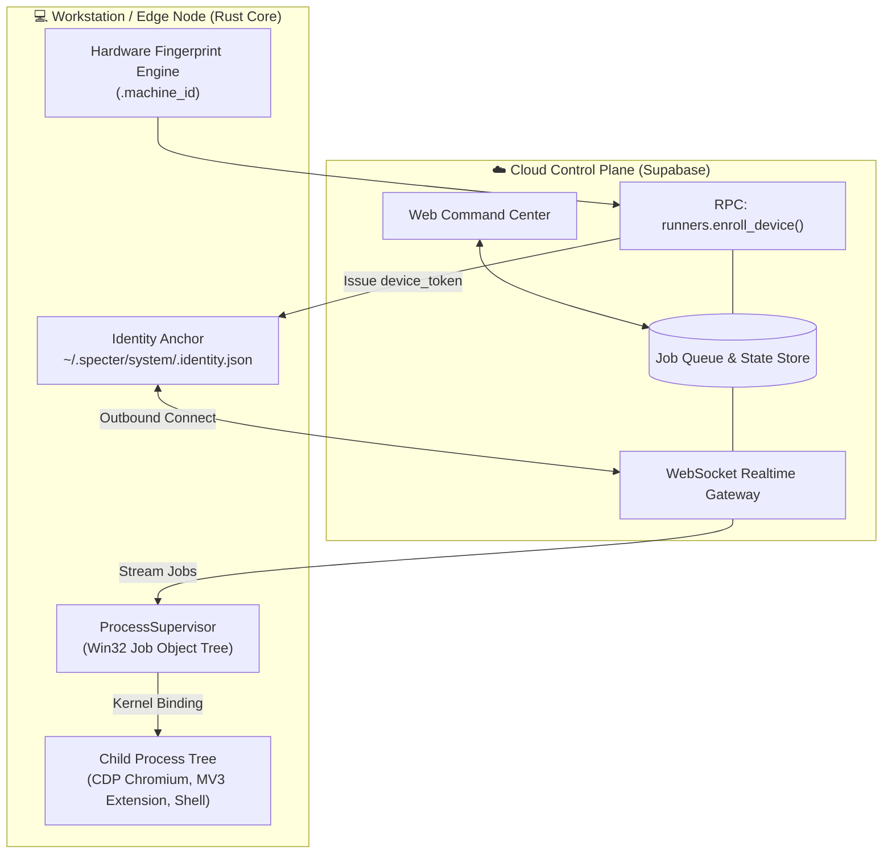

<div align="center">
  
  <h1>Specter Runner (`specter runner`)</h1>
  <p><strong>Kernel-Level Process Tree Supervisor &amp; Distributed Edge Worker Engine in Rust</strong></p>

  <p>
    <a href="https://github.com/tuquet/scoop-bucket"></a>
    <a href="https://tuquet.github.io/docs/runner/"></a>
    <a href="https://www.rust-lang.org/"></a>
    
    <a href="https://github.com/tuquet/skills/blob/main/skills/specter-runner/SKILL.md"></a>
    <a href="LICENSE"></a>
  </p>
  <p><strong><a href="https://tuquet.github.io/docs/runner/">📖 Read Full Documentation in Portal &rarr;</a> • <a href="https://github.com/tuquet/skills/blob/main/skills/specter-runner/SKILL.md">⚡ Operational Skill Reference (`/specter-runner`) &rarr;</a></strong></p>
</div>

---

## 📋 Executive Summary & Business ROI

Traditional workflow runners (written in Python, Node.js, or Electron) suffer from a critical flaw: when the parent supervisor crashes or times out, child processes (such as headless Chromium instances, shell workers, or background daemons) become **orphaned "zombie" processes**, consuming gigabytes of system memory and locking open file handles.

**Specter Runner** solves this at the operating system kernel level through native Win32 Job Object process trees:

| Strategic Pillar | The Traditional Problem | The Specter Runner Solution | Measurable Business ROI |
| :--- | :--- | :--- | :--- |
| **Zombie Child Processes** | Unhandled supervisor exit leaves headless browser and worker processes lingering in RAM. | **Win32 Job Object Supervision** binds all child processes to the kernel job lifecycle; closing the job atomically kills every child. | **Zero-Zombie Guarantee**; 100% clean process termination in <0.1ms upon worker exit. |
| **Memory Exhaustion** | Electron and Node daemons consume 300MB–800MB RAM merely sitting idle in the background. | **Ultra-Lightweight Rust Core** compiled directly to native machine code with zero runtime garbage collector. | **< 10MB RAM Idle Footprint**; allows maximum worker density on low-spec hardware. |
| **Config Drift & Lock-in** | Workstations depend on brittle, unversioned local YAML config files that drift across machines. | **Dumb Runner, Smart Cloud** architecture; minimal identity anchor in `~/.specter/system/.identity.json`, dynamic RAM config streaming. | **Zero Config Drift**; central fleet orchestration without local maintenance overhead. |

---

## 🏗️ Architecture: Dumb Runner, Smart Cloud



---

## 📜 Universal Contract Schema: Automa & Browser Convergence

**Specter Runner** standardizes job execution payloads across ecosystem pillars, seamlessly uniting **Automa** (workflow DAG execution) with **Browser** (Antidetect Chromium, deterministic PRNG fingerprint spoofing, proxy routing, and profile sandboxing):

### 1. Automa Workflow Execution with Dedicated Browser Config (`driver: "automa"`)

```json
{
  "id": "job-automa-stealth-001",
  "driver": "automa",
  "payload": {
    "workflow": {
      "path": "./fixtures/test_browser_workflow.json",
      "variables": {
        "target_domain": "example.com",
        "max_retries": 3
      }
    },
    "debug": true,
    "browser": {
      "type": "chromium",
      "version": "148",
      "profileId": "sandbox_worker_01",
      "headless": true,
      "proxy": {
        "server": "socks5://127.0.0.1:1080",
        "disableUdp": true
      },
      "fingerprint": {
        "seed": 133742,
        "platform": "windows",
        "brand": "Chrome",
        "brandVersion": "148.0.7778.215",
        "hardwareConcurrency": 8,
        "timezone": "Asia/Ho_Chi_Minh",
        "lang": "vi-VN"
      },
      "windowSize": { "width": 1920, "height": 1080 },
      "closeBrowserOnFinish": true
    }
  },
  "timeout_ms": 120000
}
```

### 2. Multi-Engine Support: Firefox & Custom Browsers

```json
{
  "id": "job-automa-firefox-001",
  "driver": "automa",
  "payload": {
    "workflow": {
      "path": "./fixtures/test_browser_workflow.json",
      "variables": {
        "browser_engine": "gecko"
      }
    },
    "browser": {
      "type": "firefox",
      "profileId": "firefox_sandbox_01",
      "headless": true,
      "proxy": {
        "server": "socks5://127.0.0.1:1080"
      },
      "windowSize": { "width": 1440, "height": 900 }
    }
  },
  "timeout_ms": 60000
}
```

### 3. Standalone Browser Runtime & Profile Management (`driver: "browser"`)

```json
{
  "id": "job-browser-probe-001",
  "driver": "browser",
  "payload": {
    "action": "status",
    "browser": {
      "type": "chromium",
      "version": "148",
      "headless": true
    }
  },
  "timeout_ms": 30000
}
```

---

## ⚡ Operational Control & Daemon Supervision

All worker daemon lifecycle commands, background supervisor execution, and health monitoring can be operated through the standalone binary (`tuquet-runner`) or the Master CLI (`specter runner`), and automated via **[Tuquet Skills](https://github.com/tuquet/skills)**:

### 1. Running Background Supervisor Daemon (`-d`)
Launch the runner as a detached supervisor daemon. It establishes the Win32 Job Object tree, initializes the local HTTP control bridge on port 8765, and awaits cloud tasks:

```powershell
# Launch detached background supervisor daemon
tuquet-runner -d

# Or launch via the unified Master CLI
specter runner start -d
```

### 2. Health Monitoring on Port 8765
The supervisor daemon exposes a local REST health check endpoint on port 8765 (`http://127.0.0.1:8765/api/v1/health`):

```powershell
# Inspect worker daemon health route via Master CLI
specter runner status

# Or check directly via HTTP GET (returns HTTP 200 OK + JSON status)
curl http://127.0.0.1:8765/api/v1/health

# Native PowerShell health check
Invoke-RestMethod http://127.0.0.1:8765/api/v1/health
```

### 3. Log Streaming & Graceful Lifecycle Control
```powershell
# Stream real-time worker logs
specter runner logs -f

# Gracefully terminate daemon and atomically clean up child process tree
specter runner stop
```

> 💡 **AI Agent Quick Execution**: In Antigravity, Claude Code, or Cursor, invoke:  
> **`/specter-runner [status|start|stop|restart|logs]`**

---

## 🚀 Installation & Distribution

### 1. Via Scoop Package Manager (Recommended for Windows Devs)
Specter Runner is available directly via the unified master CLI (`specter runner`) or as a standalone package:

```console
# Register the Tuquet Scoop Bucket
scoop bucket add tuquet https://github.com/tuquet/scoop-bucket

# Install Unified CLI (includes runner)
scoop install specter
```

### 2. Build Standalone Binary from Source (Cargo)
```console
git clone https://github.com/tuquet/runner.git
cd runner
cargo build --release
# Executable generated at: target/release/runner.exe
```

---

## 📖 Comprehensive Documentation

For complete architectural guides, job lifecycle state machine specifications, and integration examples, visit the official **Specter Documentation Portal**:

👉 **[https://tuquet.github.io/docs/runner/](https://tuquet.github.io/docs/runner/)**

---

## 📄 License

Distributed under the [MIT License](LICENSE).
