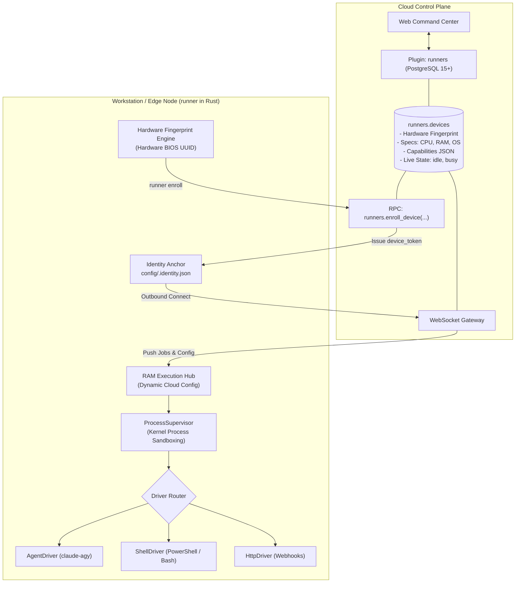

<div align="center">
  
  <h1>Runner</h1>
  <p><strong>High-Performance Distributed Process Supervision Engine in Rust with Kernel Process Tree Sandboxing</strong></p>

  <p>
    <a href="https://github.com/tuquet/scoop-bucket"></a>
    <a href="LICENSE"></a>
    <a href="https://www.rust-lang.org/"></a>
    
    
  </p>
</div>

---

## 🏗️ System Architecture: Dumb Runner, Smart Cloud

`runner` decouples the **Control Plane** (Cloud / Supabase `runners` plugin) from the **Distributed Execution Plane** (Workstations / Edge Nodes). It can be operated standalone (`runner`) or through the unified master CLI (`tuquet runner`).



---

## ✨ Key Features

- **Ergonomic Unified & Standalone CLI**: Accessible directly via `runner` or seamlessly unified through the master CLI (`tuquet runner info`, `tuquet runner enroll`, `tuquet runner exec`, `tuquet runner worker`).
- **Zero-Touch Cloud Enrollment (`runner enroll`)**: Automatically probes hardware UUID, specs (CPU cores, RAM size), and local capabilities (`claude-agy`), enrolling the machine into the Cloud Control Plane in sub-second time.
- **Dumb Runner, Smart Cloud Architecture**:
  - No static YAML drift! Workstations only store a minimal identity anchor in `config/.identity.json` (`device_id` + `device_token`).
  - Runtime configuration (concurrency, timeouts, driver toggles) lives in Cloud PostgreSQL (`runners.devices`) and streams dynamically into the runner's RAM.
- **Kernel-Level Zero-Zombie Guarantee**: Uses kernel process tree sandboxing to atomically wipe out entire process trees upon cancellation or timeout in under 0.1ms.
- **Pluggable Driver SPI**:
  - `AgentDriver`: Handshakes with `claude-agy` via `tuquet.agent.v1` protocol, validating Antigravity tokens before executing AI prompts.
  - `ShellDriver`: High-throughput shell script streaming.
  - `HttpDriver`: Native webhook dispatching and REST automation.
- **Zero-Leak Secret Masking**: SIMD-accelerated regex scanner automatically sanitizes sensitive tokens (`ya29...`, `sk-ant-...`, bearer secrets) from stdout/stderr streams before sending telemetry to the Cloud.

---

## 📦 Installation

### 1. Unified Master CLI via Scoop (Recommended)

```bash
# Add Tuquet bucket
scoop bucket add tuquet https://github.com/tuquet/scoop-bucket

# Install tuquet (includes runner engine)
scoop install tuquet
```

*Note: Scoop automatically persists `config/` (`.identity.json`, `.machine_id`) and `logs/` across version updates.*

### 2. From Source (Cargo)

```bash
git clone https://github.com/tuquet/runner.git
cd runner
cargo build --release
```
The compiled binary will be placed at `target/release/runner`.

---

## ⚡ Quick Start

### 1. System Diagnostics & Capability Inspection
Inspect your machine's hardware fingerprint, CPU/RAM, probed capabilities, and Cloud enrollment status:
```bash
tuquet runner info
# or standalone:
runner info
```

Example Output:
```text
============================================================
 Runner System Diagnostics
============================================================
 Version:      0.1.0
 Hostname:     WORKSTATION-01
 Fingerprint:  4C4C4544-0053-5810-8047-B2C04F484234
 Architecture: x86_64
 Resources:    16 CPU Cores | 16070 MB RAM
 Capabilities: ["shell:pwsh", "agent:claude-agy"]
 Supervision:  Kernel Process Sandboxing (Zero-Zombie)
 Config Path:  ~/.tuquet/config
------------------------------------------------------------
 Enrollment:   ENROLLED (Cloud Active)
 Device ID:    2a9cb9d8-dac6-4017-9214-69b65a458467
 Tenant ID:    b0000000-0000-0000-0000-000000000001
 Device Name:  WORKSTATION-01
 Cloud URL:    https://api.tuquet.dev
============================================================
```

### 2. Flexible Environment Management & Switching
`runner` supports out-of-the-box multi-environment management (`dev`, `local`, `prod`):

```bash
# List available environments and see which is active
tuquet runner env list

# Switch to Cloud Dev
tuquet runner env switch dev

# Switch to Local Docker
tuquet runner env switch local

# Configure or override a custom environment (e.g. prod)
tuquet runner env set prod --url "https://<your-prod-ref>.supabase.co" --key "<PROD_ANON_KEY>"
tuquet runner env switch prod
```

### 3. Zero-Touch Cloud Enrollment
Register your workstation with the Cloud Control Plane for a specific environment:
```bash
# Enroll directly into Local Docker (default)
tuquet runner enroll

# Enroll explicitly into Cloud Dev or Custom Environment
tuquet runner enroll --env dev
tuquet runner enroll --env prod

# Override URL and key on the fly
tuquet runner enroll --url "https://custom.supabase.co" --key "<ANON_KEY>"
```

### 4. Standalone Ad-Hoc Execution (CLI Mode)
Execute commands locally with real-time log streaming:
```bash
# Execute a shell command
tuquet runner exec -d shell -c "echo 'Running job'"

# Execute an AI agent prompt via claude-agy
tuquet runner exec -d agent -p "Explain Rust ownership in 3 bullet points"
```

### 5. Background Worker Daemon Mode
Connect outbound to the Cloud Command Center to receive jobs:
```bash
# Uses enrolled identity automatically
tuquet runner worker

# Or specify custom gateway endpoint
tuquet runner worker --server wss://hub.tuquet.dev/api/v1/runner/ws --tags "workstation,gpu,ai"
```

---

## 🔧 CLI Command Reference

| Unified Command (`tuquet runner`) | Standalone Command (`runner`) | Description |
| :--- | :--- | :--- |
| `tuquet runner info` | `runner info` | Display hardware fingerprint, specs, drivers, and active environment |
| `tuquet runner env list` | `runner env list` | List all configured environments and show active environment |
| `tuquet runner env switch <name>` | `runner env switch <name>` | Switch active environment (`dev`, `local`, `prod`) and re-enroll |
| `tuquet runner env set <name>` | `runner env set <name>` | Configure or override a custom environment endpoint |
| `tuquet runner enroll` | `runner enroll` | Enroll workstation with Cloud Dev, Local Docker, or custom endpoint |
| `tuquet runner purge` | `runner purge` | Purge local enrollment credentials (`.identity.json`) |
| `tuquet runner exec` | `runner exec` | Execute ad-hoc prompt or command locally (`shell`, `agent`, `http`) |
| `tuquet runner run <file>` | `runner run <file>` | Execute a local job specification file (`.yaml` or `.json`) |
| `tuquet runner worker` | `runner worker` | Start worker daemon listening for remote jobs from Cloud Control Plane |

### Environment Variables

| Variable | Description | Default |
| :--- | :--- | :--- |
| `TUQUET_ENV` | Target environment for enrollment (`dev`, `local`, `prod`) | `dev` |
| `TUQUET_CLOUD_URL` | Cloud / Supabase REST API endpoint | `https://dswhacsoaxgpfnkaxnhz.supabase.co` |
| `TUQUET_API_KEY` | Supabase publishable / anon public key | Loaded from environment registry |
| `TUQUET_ENROLLMENT_TOKEN` | Optional workspace registration pairing token | — |
| `TUQUET_SERVER` | WebSocket control plane gateway URL | `wss://hub.tuquet.dev/api/v1/runner/ws` |
| `TUQUET_TOKEN` | Runner authentication device token | Loaded from `config/.identity.json` |

---

## 🌐 Ecosystem

Part of the **Automation & Agent Ecosystem**:

- [Automa](https://github.com/tuquet/automa) — Native Desktop UI Automation Browser.
- [Runner](https://github.com/tuquet/runner) — High-Performance Distributed Process Supervision Engine in Rust.
- [Browser](https://github.com/tuquet/browser) — High-Performance Headless Web Scraping & Stealth Automation Core.
- [Cloud](https://github.com/tuquet/cloud) — Enterprise Orchestration & Real-time Task Control Plane.
- [CLI](https://github.com/tuquet/cli) — Developer Ergonomic CLI & Unified Command Center.
- [Lib](https://github.com/tuquet/lib) — Monorepo for Shared Enterprise UI & Utilities (`vue-ui`, `vue-table`, `md-export`, `extension-runner`, `lunar`).
- [Scoop Bucket](https://github.com/tuquet/scoop-bucket) — Official Scoop Distribution Channel.

---

## 📜 License

Licensed under the [MIT License](LICENSE).

---

<div align="center">
  <samp>
    <a href="https://tuquet.github.io">Portfolio</a> •
    <a href="https://tuquet.github.io/cv">CV &amp; Resume</a> •
    <a href="https://tuquet.github.io/automa">Automa Studio</a> •
    <a href="https://tuquet.github.io/lib">Component Lab</a> •
    <a href="https://github.com/tuquet/scoop-bucket">Scoop Bucket</a>
  </samp>
</div>
